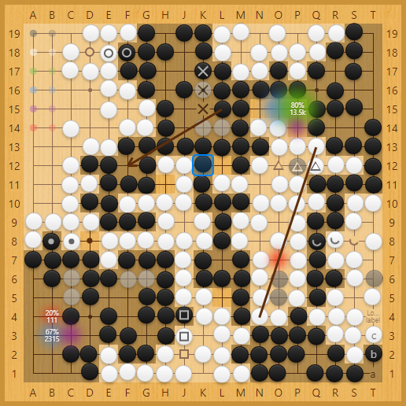

# 基于Vue.js的围棋盘组件

## 起源

[Sabaki](https://github.com/SabakiHQ/Sabaki)是一款精美的围棋软件，它的核心棋盘组件[Shudan](https://github.com/SabakiHQ/Shudan)基于Preact编写。我也很喜欢，于是用React.js重写了这个组件。

## 效果



## 示例构建

确保环境已安装Git/Node.js/npm，然后运行：

```shell
$ git clone https://github.com/winters-song/react-shudan.git
$ cd react-shudan
$ npm install
```

在浏览器里预览效果：

```shell
$ yarn start
```
